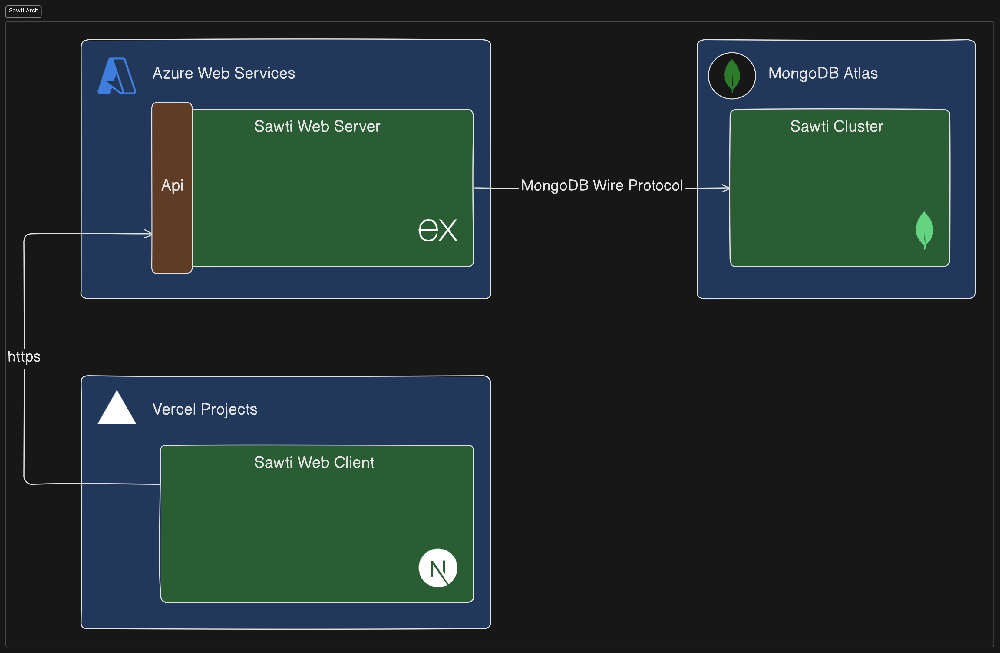

# Technical Documentation

## Presidential Election Management Application (Sawti)

### **1. Introduction**

- **Project Summary**:  
  This project involves developing a web application for managing presidential elections. The application provides features such as user registration, candidate consultation, voting, and real-time result tracking.

---

### **2. Application Architecture**

- **Technology Stack**:

  - **Frontend**: Next.js, Tailwind CSS, HeroIcons (Icons), React-Toastify (Notifications)
  - **Backend**: Node.js, Express, Zod (validation), Bcrypt (password hashing), JsonWebToken (JWT), Mongoose (MongoDB connection), NanoId (unique ID generation)
  - **Database**: MongoDB
  - **Authentication**: JSON Web Tokens (JWT)

- **Architecture Diagram**:
  

---

### **3. Main Features**

1. **Registration / Login**

   - Users register using their CIN (national identity number), password, and other infos.
   - Authentication is securely handled via JWT.

2. **User Profile**

   - Users can view and modify personal information (e.g., first name, last name, etc.).

3. **Candidate Consultation**

   - A complete list of candidates is displayed with their biographies and electoral programs.
   - Users can view details about individual candidates.

4. **Voting**

   - Users can securely cast their votes (one vote per user).
   - Backend ensures eligibility before processing the vote.

5. **Commenting**

   - Users can comment on candidates' programs to express their opinions.

6. **Real-time Election Results**

   - Results are displayed as the total number of votes for each candidate.
   - Dynamic updates occur via a user-triggered refresh button.

7. **Favorites**

   - Users can add candidates to a personal favorites list to quickly access their profiles.

8. **Search**
   - A search bar allows users to filter candidates by name.

---

### **4. Technologies Used**

- **Frontend**:

  - **Next.js**: For building the user interface quickly and effectively.
  - **Tailwind CSS**: For creating a responsive and modern design.
  - **HeroIcons**: For scalable SVG-based icons.
  - **React-Toastify**: For displaying toast notifications to users.

- **Backend**:

  - **Node.js**: For running the server.
  - **Express**: For building RESTful APIs.
  - **Zod**: For request validation.
  - **Bcrypt**: For securely hashing user passwords.
  - **JsonWebToken (JWT)**: For secure user authentication.
  - **Mongoose**: For managing MongoDB schemas and queries.
  - **NanoId**: For generating unique identifiers.

- **Database**:

  - **MongoDB**: NoSQL database for storing user, candidate, vote, and comment data.

- **Authentication**:

  - **JWT (JSON Web Tokens)**: Ensures secure authentication and user session handling.

- **Deployment**:
  - **Vercel**: Deployed for hosting the frontend application.
  - **Render**: Backend services deployed securely for API handling.

---

### **5. Development Tools**

- **Visual Studio Code**: Code editor for development.
- **Git**: Version control for tracking changes and collaboration.
- **Postman**: For testing and debugging API endpoints.
- **ESLint / Prettier**: For maintaining consistent coding standards.

---

### **6. Development Team**

- **Wassim Rached**:
  - Backend developer with a passion for software architecture and cloud engineering.
  - Currently studying at the Higher Institute of Technological Studies in Charguia.
  - More information can be found at [www.wassimrached.me](https://www.wassimrached.me).

---

### **7. Use Cases**

1. **User Registration**

   - Users provide their CIN and password via a registration form.
   - Backend validates the data, hashes the password, and creates a user account in MongoDB.

2. **User Login**

   - Users provide their CIN and password.
   - Backend verifies the credentials and generates a JWT for session management.

3. **Consult Candidates**

   - Users browse a list of candidates and can view detailed profiles, including biographies and electoral programs.

4. **Voting**

   - Users select a candidate and securely cast their votes.
   - Backend ensures the user has not voted more than once.

5. **Displaying Results**

   - Users can view the total number of votes for each candidate.
   - Refreshing the results updates the data dynamically.

6. **Commenting**

   - Users can submit comments on candidates’ electoral programs.
   - Comments are stored in the database and displayed under the candidate profiles.

7. **Search Candidates**

   - Users can search for candidates by name using the search bar.

8. **Favorites**
   - Users add candidates to a favorites list for quick access.
   - Favorites are stored in the user’s profile for persistence.

---

### **8. Future Enhancements**

- Implement real-time voting updates using **WebSockets**.
- Add support for multi-language localization (e.g., English, French, Arabic).
- Introduce advanced analytics and visualizations for election results using charting libraries (e.g., Chart.js, D3.js).
- Extend the platform to manage legislative or regional elections.
- Improve server performance using caching mechanisms like **Redis**.

---

### **9. Conclusion**

- This application demonstrates the use of modern web technologies to deliver a secure, user-friendly platform for managing presidential elections.
- With its modular design and robust architecture, the application is scalable and can be extended with additional features.
